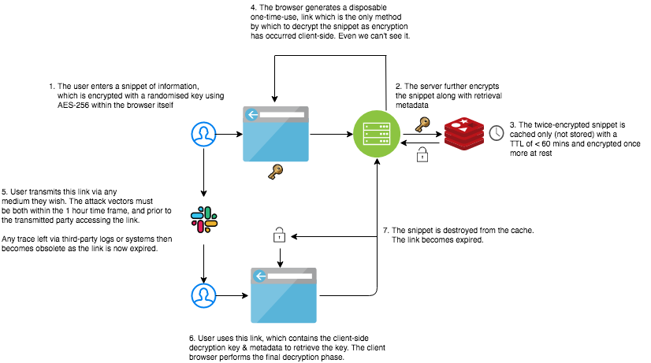

Tin Can
========

Tin Can was designed with fellow developers in mind. It allows users to send sensitive text snippets (keys, tokens and passwords) securely, quickly and simply.

### How It Works

Tin Can does not store any secret long term, and no secret leaves your browser unencrypted. The application encrypts the secret (using AES-256) **prior** to submission within the browser, and the secret is encrypted again at caching, and once more at rest. All cached secrets and links expire within an hour, and the only method of accessing 
a secret is using the generated link that is made on submission. *Every* link is one-time access only and disposable. 

All configurations, settings and code are open-source. You can see what we do, and how we do it. Your secrets are safe with us. 

#### How It Works: At a glance

#### How to run

You can clone and run this service locally. To do so, ensure that you have an environment variable `KEY` exported locally. Make commands have been constructed for convenience.

Ensure your key is exported with `export KEY=EXAMPLE_KEY` then run `make run`

#### Our Commitment
We want to make development a little easier. **We don't track. We don't store anything about you.**

